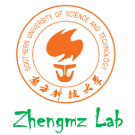
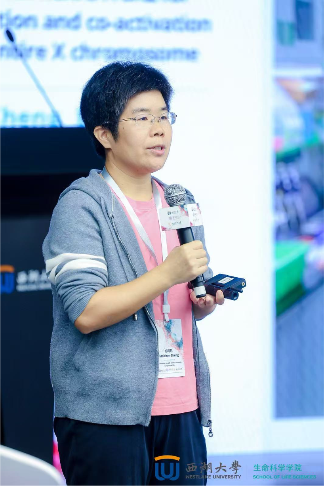
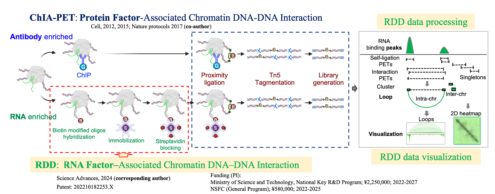
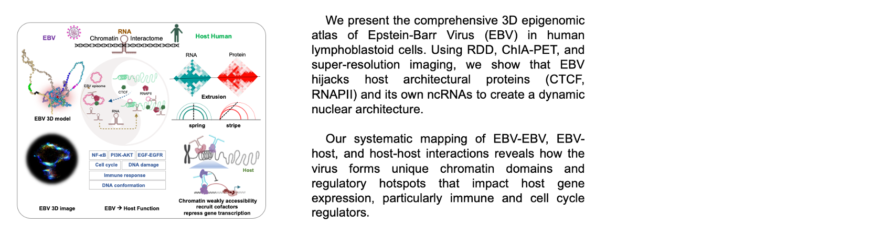
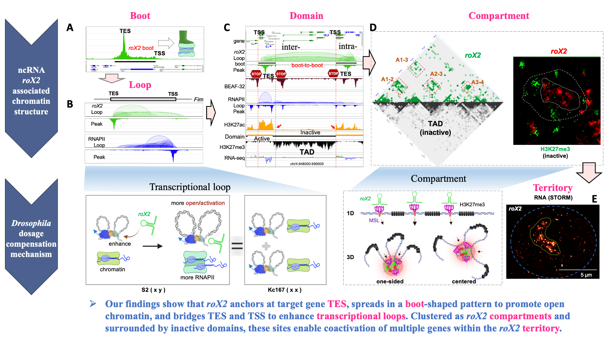
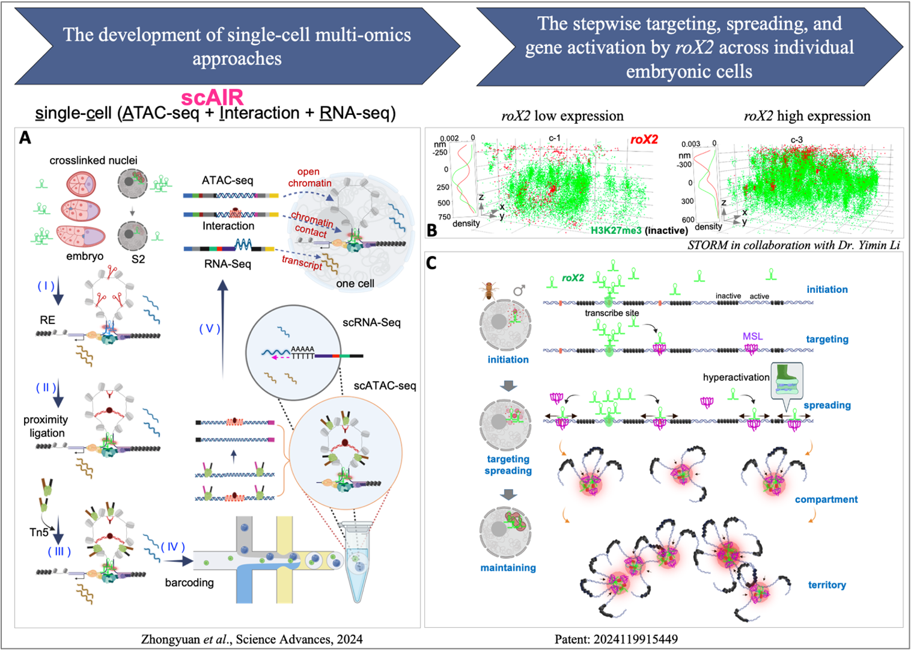
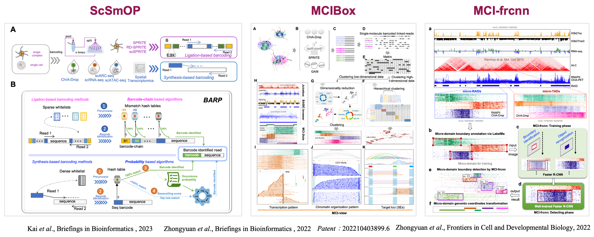

# ZhengMZLab

 

<nav class="bg-gray-100 p-4 rounded shadow flex justify-center space-x-6">
  <a href="#home" class="text-blue-600 hover:text-blue-900 font-semibold">Home</a>
  <a href="#research" class="text-blue-600 hover:text-blue-900 font-semibold">Research</a>
  <a href="#teaching" class="text-blue-600 hover:text-blue-900 font-semibold">Teaching</a>
  <a href="#publications" class="text-blue-600 hover:text-blue-900 font-semibold">Publications</a>
  <a href="#members" class="text-blue-600 hover:text-blue-900 font-semibold">Members</a>
  <a href="#resource" class="text-blue-600 hover:text-blue-900 font-semibold">Resource</a>
  <a href="#join-us" class="text-blue-600 hover:text-blue-900 font-semibold">Join Us</a>
  <a href="#news" class="text-blue-600 hover:text-blue-900 font-semibold">News</a>
</nav>

Principal Investigator  
Meizhen Zheng, Ph.D.  
  Assistant Professor (2019-)  
  School of Life Sciences  
  Southern University of Science and Technology  

**Education and Training**  
- Ph.D., Sun Yat-Sen University Cancer Center  
- Postdoctoral Training, Genome Institute of Singapore (GIS)  
- Postdoctoral Training, The Jackson Laboratory for Genomic Medicine (JGM)  

**Email:** [zhengmz@sustech.edu.cn](mailto:zhengmz@sustech.edu.cn)  
**ORCID:** [https://orcid.org/0000-0001-5569-1812](https://orcid.org/0000-0001-5569-1812)

---

 
## HOME
## [TOP](#I)

#### The development and application of 3D genome interactome technology

#### Unraveling the roles of 3D chromatin architecture in gene regulation during health and disease

Zheng Lab primary research interest focuses on developing three-dimensional (3D) genome technologies, with the long-term goal of establishing single-cell, single-molecule multi-omics approaches. My team harnesses these innovative methodologies to unravel the spatial organization of nuclear chromatin and gene expression dynamics, both in normal physiology and diseases. My lab integrates the development of 3D genome mapping (wet-lab) techniques and computational software for data analysis and visualization (dry-lab), providing a comprehensive toolbox for chromatin research.

---

 
## [RESEARCH](#I)

**Zheng Lab's core achievements** from 2020 to 2025 include: **(1)** developing innovative methods for mapping **RNA-associated chromatin DNA-DNA interactions (RDD)**, which have revealed new mechanisms by which non-coding RNAs regulate chromatin architecture and gene expression;**(2)** establishing **single-cell multi-omics technologies (scAIR)** that enable simultaneous profiling of chromatin accessibility, chromatin interactions, and transcriptomes within individual cells, offering novel insights into gene regulation at the single-cell level; and **(3)** creating efficient **computational and visualization tools (ScSmOP, MCIBox, MCI-frcnn)** for multi-omics and chromatin interaction data analysis, including the integration of artificial intelligence for automated chromatin structure identification. Collectively, these efforts have provided new tools and perspectives for investigating nuclear organization and gene regulation in both health and disease.

#### I. RNA-associated Chromatin DNA-DNA Interactions (RDD)

We present the comprehensive 3D epigenomic atlas of Epstein-Barr Virus (EBV) in human lymphoblastoid cells. Using RDD, ChIA-PET, and super-resolution imaging, we show that EBV hijacks host architectural proteins (CTCF, RNAPII) and its own ncRNAs to create a dynamic nuclear architecture. Our systematic mapping of EBV-EBV, EBV-host, and host-host interactions reveals how the virus forms unique chromatin domains and regulatory hotspots that impact host gene expression, particularly immune and cell cycle regulators.

  

#### II. Single-Cell Multi-Omics Technologies (scAIR)

To address the heterogeneity of chromatin and transcriptional regulation at the single-cell level, our group established the **scAIR** (single-cell ATAC-seq + Interaction + RNA-seq) multi-omics technology (Science Advances 2024). This platform enables the <u>simultaneous measurement of chromatin accessibility, long-range interactions, and RNA expression states from the same nucleus</u>, thus capturing the stepwise targeting, spreading, and gene activation by roX2 across individual embryonic cells.

#### III. Computational and Visualization Tools

To address the growing complexity and volume of single-cell and multi-omics chromatin data, my team <u>developed a comprehensive suite of computational pipelines and visualization platforms</u>:

  
---

 
## [TEACHING](#I)

#### I teach core courses in genomics at both undergraduate and graduate levels:

- Genomics (BIO350): Foundational genomics for undergraduates.  
- Spatial Genomics (BIO7008): Advanced graduate course integrating current research and applications.  
- Graduation Project (BIO490): Project-based course providing hands-on research experience.  
- Research Training (BIO480A017): Practical training in experimental design and data analysis.## PUBLICATIONS

---

 
## [PUBLICATIONS](#I)

#### Corresponding author

1. Tian, Simon Zhongyuan#,\*; Yang, Yang#; Ning, Duo#; Yu, Ting#; Gao, Tong; Deng, Yuqing; Fang, Ke; Xu, Yewen; Jing, Kai; Huang, Guangyu; Chen, Gengzhan; Yin, Pengfei; Li, Yiming; Zeng, Fuxing\*; Tian, Ruilin\*; **Zheng, Meizhen\***. *Landscape of the Epstein-Barr virus-host chromatin interactome and gene regulation.* The EMBO Journal, 2025, accepted. ***Impact factor: 9.4; Corresponding author***

2. Tian, Simon Zhongyuan#,\*; Yang, Yang#; Ning, Duo#; Fang, Ke#; Jing, Kai; Huang, Guangyu; Xu, Yewen; Yin, Pengfei; Huang, Haibo; Chen, Gengzhan; Deng, Yuqing; Zhang, Shaohong; Zhang, Zhimin; Chen, Zhenxia; Gao, Tong; Chen, Wei; Li, Guoliang; Tian, Ruilin; Ruan, Yijun\*; Li, Yiming\*; **Zheng, Meizhen\***. [*3D chromatin structures associated with ncRNA roX2 for hyperactivation and coactivation across the entire X chromosome.*](https://www.science.org/doi/10.1126/sciadv.ado5716) Science Advances, 2024, 10(30): eado5716. ***Impact factor: 13.6; Corresponding author***

3. Yang, Yang; Chen, Gengzhan; Gao, Tong; Ning, Duo; Deng, Yuqing; Tian, Simon Zhongyuan\*; **Zheng, Meizhen\***. [*Tn5-Labeled DNA-FISH: An Optimized Probe Preparation Method for Probing Genome Architecture.*](https://www.mdpi.com/1422-0067/26/5/2224) International Journal of Molecular Sciences, 2025, 26(5): 2224. ***Impact factor: 6.208; Corresponding author***

4. Ning, Duo; Deng, Yuqing; Gao, Tong; Yang, Yang; Chen, Gengzhan; Tian, Simon Zhongyuan\*; **Zheng, Meizhen\***. [*TF-chRDP: a method for simultaneously capturing transcription factor binding chromatin-associated RNA, DNA and protein.*](https://www.frontiersin.org/journals/cell-and-developmental-biology/articles/10.3389/fcell.2025.1561540/full) Frontiers in Cell and Developmental Biology, 2025, 13: 1561540. ***Impact factor: 6.684; Corresponding author***

5. Jing, Kai; Xu, Yewen; Yang, Yang; Yin, Pengfei; Ning, Duo; Huang, Guangyu; Deng, Yuqing; Chen, Gengzhan; Li, Guoliang; Tian, Simon Zhongyuan\*; **Zheng, Meizhen\***. [*ScSmOP: a universal computational pipeline for single-cell single-molecule multiomics data analysis.*](https://academic.oup.com/bib/article/doi/10.1093/bib/bbad343/7287425) Briefings in Bioinformatics, 2023, 24(6): bbad343. ***Impact factor: 9.5; Corresponding author***

6. Tian, Simon Zhongyuan\*; Li, Guoliang; Ning, Duo; Jing, Kai; Xu, Yewen; Yang, Yang; Fullwood, Melissa J; Yin, Pengfei; Huang, Guangyu; Plewczynski, Dariusz; Zhai, Jixian; Dai, Ziwei; Chen, Wei; **Zheng, Meizhen\***. [*MCIBox: a toolkit for single-molecule multi-way chromatin interaction visualization and micro-domains identification.*](https://doi.org/10.1093/bib/bbac380) Briefings in Bioinformatics, 2022, 23(6): bbac380. ***Impact factor: 13.994; Corresponding author***

7. Tian, Simon Zhongyuan\*; Yin, Pengfei; Jing, Kai; Yang, Yang; Xu, Yewen; Huang, Guangyu; Ning, Duo; Fullwood, Melissa J\*; **Zheng, Meizhen\***. [*MCI-frcnn: A deep learning method for topological micro-domain boundary detection.*](https://www.frontiersin.org/journals/cell-and-developmental-biology/articles/10.3389/fcell.2022.1050769/full) Frontiers in Cell and Developmental Biology, 2022, 10: 1050769. ***Impact factor: 6.684; Corresponding author***

#### First author

8. **Zheng, Meizhen**; Tian, Simon Zhongyuan; Capurso, Daniel; Kim, Minji; Maurya, Rahul; Lee, Byoungkoo; Piecuch, Emaly; Gong, Liang; Zhu, Jacqueline Jufen; Li, Zhihui; Wong, Chee Hong; Ngan, Chew Yee; Wang, Ping; Ruan, Xiaoan; Wei, Chia-Lin; Ruan, Yijun\*. [*Multiplex chromatin interactions with single-molecule precision.*](https://www.science.org/doi/10.1126/science.aab1601) Nature, 2019, 566(7745): 558-562. ***Impact factor: 69.504; First author***

9. **Zheng, Meizhen**; Zheng, L-M; Zeng, Yi-Xin\*. [*SCC-112 gene is involved in tumor progression and promotes the cell proliferation in G2/M phase.*](https://link.springer.com/article/10.1007/s00432-007-0306-x) Journal of Cancer Research and Clinical Oncology, 2008, 134: 453-462. ***Impact factor: 4.3; First author***

10. **Zheng, Meizhen**; Qin, Hai-De; Yu, Xing-Juan; Zhang, Ru-Hua; Chen, Li-Zhen; Feng, Qi-Sheng; Zeng, Yi-Xin\*. [*Haplotype of gene Nedd4 binding protein 2 associated with sporadic nasopharyngeal carcinoma in the Southern Chinese population.*](https://translational-medicine.biomedcentral.com/articles/10.1186/1479-5876-5-36) Journal of Translational Medicine, 2007, 5: 7. ***Impact factor: 6.800; First author***

11. **Zheng, Meizhen**; Jiang, Jianwei\*. *Progress in unmethylated immunostimulatory oligodeoxynucletides.* Progress in Biochemistry and Biophysics, 2003, 30(2): 190-193. ***Impact factor (Chinese): 1.0~1.5; First author***

#### Other

12. Chen, Rui; Shi, Xinyao; Yao, Xiangrui; Gao, Tong; Huang, Guangyu; Ning, Duo; Cao, Zemin; Xu, Youxin; Liang, Weizheng; Tian, Simon Zhongyuan; Zhu, Qionghua; Fang, Liang; **Zheng, Meizhen**; Hu, Yuhui; Cui, Huanhuan\*; Chen, Wei\*. [*Specific multivalent molecules boost CRISPR-mediated transcriptional activation.*](https://www.nature.com/articles/s41467-024-51694-y) Nature Communications, 2024, 15(1): 7222. ***Impact factor: 16.6***

13. Li, Zhuowen#; Long, Yanping#; Yu, Yiming; Zhang, Fei; Zhang, Hong; Liu, Zhijian; Jia, Jinbu; Mo, Weipeng; Tian, Simon Zhongyuan; **Zheng, Meizhen**; Zhai, Jixian\*. [*Pore-C simultaneously captures genome-wide multi-way chromatin interaction and associated DNA methylation status in Arabidopsis.*](https://onlinelibrary.wiley.com/doi/10.1111/pbi.13811) Plant Biotechnology Journal, 2022, 20(6): 1009. ***Impact factor: 8.154***

14. Chen, Tao#; Lin, Yu-Xin#; Zha, Yan#; Sun, Ying; Tian, Jinxiu; Yang, Zhiying; Lin, Shan-Wen; Yu, Fuxun; Chen, Zi-Sheng; Kuang, Bo-Hua; Lei, Jin-Ju; Nie, Ying-Jie; Xu, Yonghao; Tian, Dong-Bo; Li, Ying-Zi; Yang, Bin; Xu, Qiang; Yang, Li; Zhong, Nanshan; **Zheng, Meizhen**; Li, Yimin; Zhao, Jincun; Zhang, Xiang-Yan; Feng, Lin\*. [*A low-producing haplotype of interleukin-6 disrupting CTCF binding is protective against severe COVID-19.*](https://journals.asm.org/doi/full/10.1128/mbio.01372-21) MBio, 2021, 12(5). ***Impact factor: 6.4***

15. Wang, Ping#; Tang, Zhonghui#; Lee, Byoungkoo; Zhu, Jacqueline Jufen; Cai, Liuyang; Szalaj, Przemyslaw; Tian, Simon Zhongyuan; **Zheng, Meizhen**; Plewczynski, Dariusz; Ruan, Xiaoan; Liu, Edison T; Wei, Chia-Lin; Ruan, Yijun\*. [*Chromatin topology reorganization and transcription repression by PML-RARα in acute promyeloid leukemia.*](https://genomebiology.biomedcentral.com/articles/10.1186/s13059-020-02030-2) Genome Biology, 2020, 21: Jan-21. ***Impact factor: 14.3***

16. Kim, Minji; **Zheng, Meizhen**; Tian, Simon Zhongyuan; Lee, Byoungkoo; Chuang, Jeffrey H; Ruan, Yijun\*. [*MIA-Sig: multiplex chromatin interaction analysis by signal processing and statistical algorithms.*](https://doi.org/10.1186/s13059-019-1868-z) Genome Biology, 2019, 20: Jan-13. ***Impact factor: 14.3***

17. Li, Xingwang#; Luo, Oscar Junhong#; Wang, Ping; **Zheng, Meizhen**; Wang, Danjuan; Piecuch, Emaly; Zhu, Jacqueline Jufen; Tian, Simon Zhongyuan; Tang, Zhonghui; Li, Guoliang; Ruan, Yijun\*. [*Long-read ChIA-PET for base-pair-resolution mapping of haplotype-specific chromatin interactions.*](http://www.nature.com/articles/nprot.2017.012) Nature Protocols, 2017, 12(5): 899-915. ***Impact factor: 14.3***

18. Dekker, Job; Belmont, Andrew S; Guttman, Mitchell; Leshyk, Victor O; Lis, John T; Lomvardas, Stavros; Mirny, Leonid A; O'Shea, Clodagh C; Park, Peter J; Ren, Bing; Politz, Joan C Ritland; Shendure, Jay; Zhong, Sheng; 4D Nucleome Network. [*The 4D nucleome project.*](https://www.nature.com/articles/nature23884) Nature, 2017, 549(7671): 219-226. ***Impact factor: 69.504; Zheng, Meizhen is a member of the 4D Nucleome Network***

19. Tang, Zhonghui#; Luo, Oscar Junhong#; Li, Xingwang#; **Zheng, Meizhen**; Zhu, Jacqueline Jufen; Szalaj, Przemyslaw; Trzaskoma, Pawel; Magalska, Adriana; Wlodarczyk, Jakub; Ruszczycki, Blazej; Michalski, Paul; Piecuch, Emaly; Wang, Ping; Wang, Danjuan; Tian, Simon Zhongyuan; Penrad-Mobayed, May; Sachs, Laurent M; Ruan, Xiaoan; Wei, Chia-Lin; Liu, Edison T; Wilczynski, Grzegorz M; Plewczynski, Dariusz; Li, Guoliang; Ruan, Yijun\*. [*CTCF-mediated human 3D genome architecture reveals chromatin topology for transcription.*](https://linkinghub.elsevier.com/retrieve/pii/S0092867415015044) Cell, 2015, 163(7): 1611-1627. ***Impact factor: 66.850***

20. Li, Guoliang#; Ruan, Xiaoan#; Auerbach, Raymond K#; Sandhu, Kuljeet Singh#; **Zheng, Meizhen**; Wang, Ping; Poh, Huay Mei; Goh, Yufen; Lim, Joanne; Zhang, Jingyao; Sim, Hui Shan; Peh, Su Qin; Mulawadi, Fabianus Hendriyan; Ong, Chin Thing; Orlov, Yuriy L; Hong, Shuzhen; Zhang, Zhizhuo; Landt, Steve; Raha, Debasish; Euskirchen, Ghia; Wei, Chia-Lin; Ge, Weihong; Wang, Huaien; Davis, Carrie; Fisher-Aylor, Katherine I; Mortazavi, Ali; Gerstein, Mark; Gingeras, Thomas; Wold, Barbara; Sun, Yi; Fullwood, Melissa J; Cheung, Edwin; Liu, Edison; Sung, Wing-Kin; Snyder, Michael\*; Ruan, Yijun\*. [*Extensive promoter-centered chromatin interactions provide a topological basis for transcription regulation.*](https://doi.org/10.1016/j.cell.2011.12.014) Cell, 2012, 148(1): 84-98. ***Impact factor: 66.850***

21. ENCODE Project Consortium. [*An integrated encyclopedia of DNA elements in the human genome.*](https://www.nature.com/articles/nature11247) Nature, 2012, 489(7414): 57. ***Impact factor: 69.504; Zheng, Meizhen is a member of the ENCODE Project Consortium***

22. Zeng, Huilan\*; Han, Xinai; Gu, Chen; Jiang, Jianwei; **Zheng, Meizhen**; Yan, Yuxia; Zeng, Yaoying; Di, Jingfang. *Delivery and immunologic efficacy of CpG ODN targeting B lymphocytes of umbilical cord blood by CD40 ligand-receptor-mediated carrier.* Chinese Journal of Tissue Engineering Research, 2009: 974-978. ***Impact factor (Chinese): 1.0~1.5***

23. Zeng, Huilan\*; Zhu, Kanger; Jiang, Jianwei; Gu, Huaimin; Cai, Jiye; Cheng, Longqiu; Yang, Zhigang; **Zheng, Meizhen**. *The prevention of acute graft versus host disease by Rhodamine 123-mediated photodynamic therapy.* Chinese Journal of Pathophysiology, 2000. ***Impact factor (Chinese): 1.0~1.5***

24. Jiang, Jianwei\*; **Zheng, Meizhen**; Zeng, Huilan; Zeng, Yaoying; Di, Jingfang; Yan, Yuxia; Wu, Meiyu. *Preparation of CD40L-PLL-CpG ODN conjugated complex and its targeting B lymphocytes.* Chinese Journal of Pathophysiology, 2005. ***Impact factor (Chinese): 1.0~1.5***

---

 
## [MEMBERS](#I)

#### Current Lab Members

- <strong>Duo Ning</strong> (PhD student)  
- <strong>Yang Yang</strong> (PhD student)  
- <strong>Tong Gao</strong> (PhD student)  
- <strong>Yuqing Deng</strong> (PhD student)  
- <strong>Gengzhan Chen</strong> (MS student)  
- <strong>Mazhuo Wang</strong> (Undergraduate student)  
- <strong>Weizhen Luo</strong> (Undergraduate student)  
- <strong>Yanhong Liu</strong> (Administrative Assistant)  

#### Alumni

- <strong>Kai Jing</strong> (MS student), now a PhD candidate at University of Westlake  
- <strong>Yewen Xu</strong> (MS student), now a Research fellow at BGI  
- <strong>Guangyu Huang</strong> (MS student)  
- <strong>Pengfei Yin</strong> (MS student), now a PhD student at University Medical Center G??ttingen  
- <strong>Wenxin Wang</strong> (Undergraduate student), now a MS student at HKUST  
- <strong>Yuxin Lin</strong> (PhD student from Sun Yat-sen University), visiting student  
- <strong>Liuyang Cai</strong> (PhD student from The Chinese University of Hong Kong), visiting student  
- <strong>Xin Gan</strong>, visiting scholar  
- <strong>Ziying Wang</strong>, Administrative Assistant  

---

 
## [RESOURCE](#I)

---

 
## [JOIN US](#I)

---

 
## [NEWS](#I)

---

