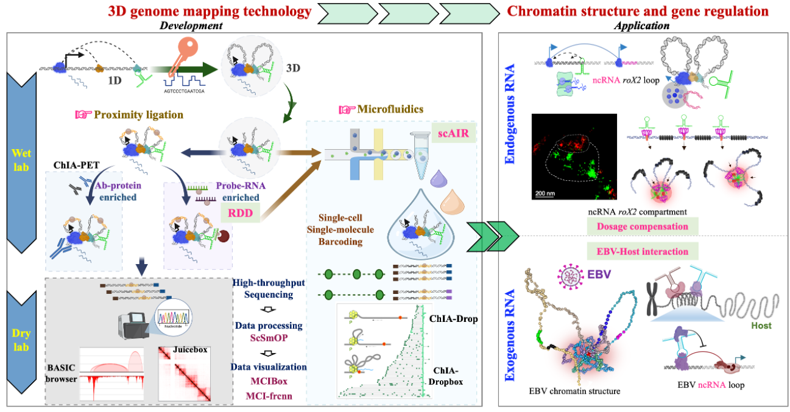

|[HOME](https://www.zhengmzlab.com/index.md)|[RESEARCH](https://www.zhengmzlab.com/research.html)|[TEACHING](https://www.zhengmzlab.com/teaching.html)|[PUBLICATIONS](https://www.zhengmzlab.com/publications.html)|[MEMBERS](https://www.zhengmzlab.com/members.html)|[RESOURCE](https://www.zhengmzlab.com/resource.html)|[JOIN US](https://www.zhengmzlab.com/join_us.html)|

## The development and application of 3D genome interactome technology

### Unraveling the roles of 3D chromatin architecture in gene regulation during health and disease

Zheng Lab primary research interest focuses on developing three-dimensional (3D) genome technologies, with the long-term goal of establishing single-cell, single-molecule multi-omics approaches. My team harnesses these innovative methodologies to unravel the spatial organization of nuclear chromatin and gene expression dynamics, both in normal physiology and diseases. My lab integrates the development of 3D genome mapping (wet-lab) techniques and computational software for data analysis and visualization (dry-lab), providing a comprehensive toolbox for chromatin research.

