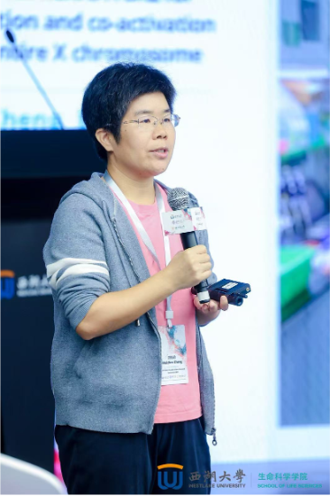

## MEMBERS

#### Our laboratory warmly welcomes and invites individuals who have a passion for or are interested in the development of 3D genomics technologies to join us. We are eager to collaborate with people who share this enthusiasm.

Principal Investigator  
Meizhen Zheng, Ph.D.  
  Associate Professor (2025-)  
  School of Life Sciences  
  Southern University of Science and Technology  

**Scientific Experience**  
- Ph.D., Sun Yat-Sen University Cancer Center, China  
- Postdoctoral Fellow, Genome Institute of Singapore, Singapore  
- Postdoctoral Fellow, The Jackson Laboratory for Genomic Medicine, USA  
- Assistant Professor, Southern University of Science and Technology, China
- Associate Professor, Southern University of Science and Technology, China

**Contact Information**  
- **Email:** [zhengmz@sustech.edu.cn](mailto:zhengmz@sustech.edu.cn)  
- **ORCID:** [https://orcid.org/0000-0001-5569-1812](https://orcid.org/0000-0001-5569-1812)
- **Page:** [https://www.zhengmzlab.com/](https://www.zhengmzlab.com/)

---

#### Current Lab Members

- <strong>Yang Yang</strong> (Postdoc)  
- <strong>Tong Gao</strong> (PhD student)  
- <strong>Yuqing Deng</strong> (PhD student)  
- <strong>Gengzhan Chen</strong> (MS student)  
- <strong>Weizhen Luo</strong> (Undergraduate student)  
- <strong>Yanhong Liu</strong> (Administrative Assistant)
- <strong>Rongrong Chang</strong> (Research Assistant)

#### Alumni

- <strong>Duo Ning</strong> (PhD student), now Postdoc at Shenzhen Bay Laboratory (SZBL)
- <strong>Mazhuo Wang</strong> (Undergraduate student), now PhD at Zhejiang University
- <strong>Kai Jing</strong> (MS student), now a PhD candidate at University of Westlake  
- <strong>Yewen Xu</strong> (MS student), now a Research fellow at BGI  
- <strong>Guangyu Huang</strong> (MS student)  
- <strong>Pengfei Yin</strong> (MS student), now a PhD student at University Medical Center Göttingen  
- <strong>Wenxin Wang</strong> (Undergraduate student), now a MS student at HKUST  
- <strong>Yuxin Lin</strong> (PhD student from Sun Yat-sen University), visiting student  
- <strong>Liuyang Cai</strong> (PhD student from The Chinese University of Hong Kong), visiting student  
- <strong>Xin Gan</strong>, visiting scholar  
- <strong>Ziying Wang</strong>, Administrative Assistant  

