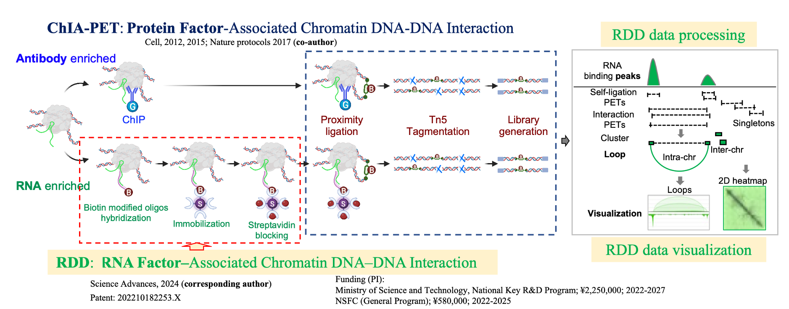
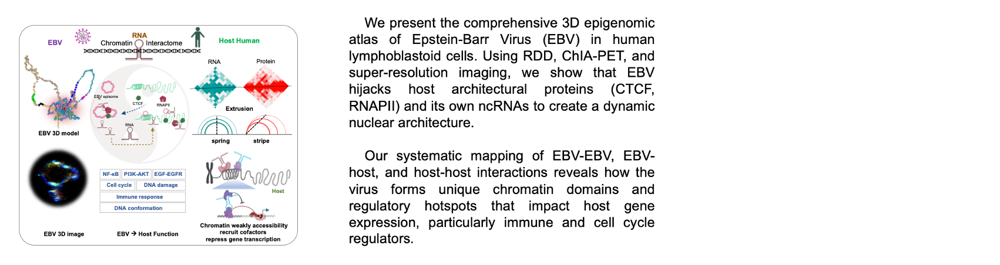
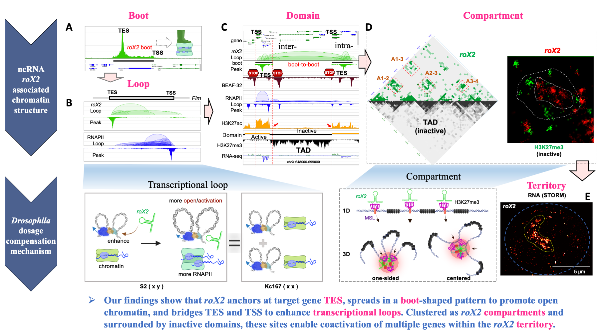

## RESEARCH

**Zheng Lab's core achievements** from 2020 to 2025 include: **(1)** developing innovative methods for mapping **RNA-associated chromatin DNA-DNA interactions (RDD)**, which have revealed new mechanisms by which non-coding RNAs regulate chromatin architecture and gene expression;**(2)** establishing **single-cell multi-omics technologies (scAIR)** that enable simultaneous profiling of chromatin accessibility, chromatin interactions, and transcriptomes within individual cells, offering novel insights into gene regulation at the single-cell level; and **(3)** creating efficient **computational and visualization tools (ScSmOP, MCIBox, MCI-frcnn)** for multi-omics and chromatin interaction data analysis, including the integration of artificial intelligence for automated chromatin structure identification. Collectively, these efforts have provided new tools and perspectives for investigating nuclear organization and gene regulation in both health and disease.

### I. RNA-associated Chromatin DNA-DNA Interactions (RDD)

### II. Single-Cell Multi-Omics Technologies (scAIR)

To address the heterogeneity of chromatin and transcriptional regulation at the single-cell level, our group established the **scAIR** (single-cell ATAC-seq + Interaction + RNA-seq) multi-omics technology (Science Advances 2024). This platform enables the <u>simultaneous measurement of chromatin accessibility, long-range interactions, and RNA expression states from the same nucleus</u>, thus capturing the stepwise targeting, spreading, and gene activation by roX2 across individual embryonic cells.

### III. Computational and Visualization Tools
To address the growing complexity and volume of single-cell and multi-omics chromatin data, my team <u>developed a comprehensive suite of computational pipelines and visualization platforms</u>:

